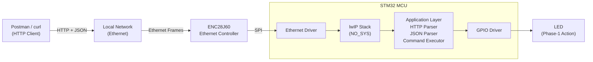

# HTTP-JSON-Assistant

## Overview

HTTP-JSON-Assistant is a bare-metal embedded HTTP server on STM32G071RB that receives JSON commands over Ethernet and executes hardware actions deterministically.

---

## 📁 Repository Structure

This project is maintained in **two separate branches** to support different development workflows:

### 🔷 **Main Branch** (STM32CubeIDE Version)
- **Purpose**: Development using STM32CubeIDE
- **Toolchain**: STM32CubeIDE integrated toolchain
- **Build System**: Eclipse/STM32CubeIDE project files
- **Target Audience**: Developers using STM32CubeIDE GUI
- **Recommended For**: Beginners, GUI-based debugging, STM32CubeMX integration

### 🔶 **Non-IDE Branch** (Makefile Version)
- **Purpose**: Command-line based development
- **Toolchain**: ARM GCC (`arm-none-eabi-gcc`)
- **Build System**: Makefile
- **Target Audience**: Developers preferring command-line workflows
- **Recommended For**: CI/CD pipelines, advanced users, bare-metal enthusiasts

---

## 🚀 Getting Started

### Choose Your Development Path

**If you want to use STM32CubeIDE:**
```bash
# You're already on the correct branch (main)
# Open the project in STM32CubeIDE:
# File → Open Projects from File System → Select project root
```

**If you want to use command-line tools:**
```bash
# Switch to the Non-IDE branch
git checkout non-ide
```

---

## 🔧 Build Instructions

### For Main Branch (STM32CubeIDE)

#### Prerequisites
- STM32CubeIDE (version 1.13.0 or later)
- ST-Link debugger (built into NUCLEO board)
- STM32CubeMX (integrated with STM32CubeIDE)

#### Building the Project
1. Open STM32CubeIDE
2. Import the project:
   - **File** → **Open Projects from File System**
   - Navigate to the project root directory
   - Click **Finish**
3. Build the project:
   - Right-click on the project → **Build Project**
   - Or press `Ctrl+B` (Windows/Linux) / `Cmd+B` (Mac)

#### Flashing to Target
1. Connect the NUCLEO-G071RB board via USB
2. Click the **Run** button (green play icon) or press `F11`
3. STM32CubeIDE will automatically build and flash the firmware

#### Debugging
1. Set breakpoints in your code
2. Click **Debug** button or press `F11`
3. Use the debug perspective for step-by-step execution

#### Project Structure (IDE Version)
```
HTTP-JSON-Assistant/
├── .settings/              # Eclipse/IDE settings
├── Core/
│   ├── Inc/                # Header files
│   ├── Src/                # Source files
│   └── Startup/            # Startup assembly
├── Drivers/                # STM32 HAL drivers
├── Middlewares/            # lwIP stack
├── STM32CubeIDE/          # IDE-specific files
├── .cproject              # C/C++ project configuration
├── .project               # Eclipse project file
├── ENC_SPI_HAL_G071RB.ioc # STM32CubeMX configuration
└── STM32G071RBTX_FLASH.ld # Linker script
```

---

### For Non-IDE Branch (Makefile)

> **Note**: Switch to the `non-ide` branch to access these instructions.

#### Prerequisites
- ARM GCC toolchain (`arm-none-eabi-gcc` v10.3 or later)
- OpenOCD (for flashing)
- ST-Link debugger
- Make utility
- STM32G071RB development board (NUCLEO-G071RB)

#### Installation (Ubuntu/Debian)
```bash
# Install ARM GCC toolchain
sudo apt-get update
sudo apt-get install gcc-arm-none-eabi

# Install OpenOCD
sudo apt-get install openocd

# Install make
sudo apt-get install build-essential

# Verify installation
arm-none-eabi-gcc --version
openocd --version
```

#### Building the Project
```bash
# Clean previous build artifacts
make clean

# Build the project
make all

# View build artifacts
ls -lh build/
```

#### Flashing to Target
```bash
# Connect NUCLEO board via USB
# Flash the firmware
make flash
```

#### Additional Commands
```bash
# View disassembly
make disasm

# Clean and rebuild
make clean && make all

# Debug build (with symbols)
make DEBUG=1
```

#### Project Structure (Non-IDE Version)
```
HTTP-JSON-Assistant/
├── src/
│   ├── drivers/         # Hardware drivers (RCC, GPIO, SPI, etc.)
│   ├── net/             # lwIP network stack integration
│   ├── protocol/        # HTTP parser
│   └── app/             # JSON parser, command executor
├── inc/                 # Header files
├── startup/             # Startup assembly
├── linker/              # Linker script
├── tests/               # TDD test infrastructure
│   ├── unit/            # Driver unit tests
│   ├── integration/     # Hardware integration tests
│   └── system/          # End-to-end tests
├── Makefile             # Build configuration
└── openocd.cfg          # OpenOCD configuration
```

---

## 📡 Hardware Setup

### Connections
- **STM32G071RB NUCLEO Board**
  - PA1 → ENC28J60 SCK
  - PA6 → ENC28J60 MISO
  - PA7 → ENC28J60 MOSI
  - PA5 → ENC28J60 CS
  - PA2 → UART TX (Serial debug)
  - PA3 → UART RX (Serial debug)

### Network Configuration
- **Static IP**: 192.168.0.200
- **Netmask**: 255.255.255.0
- **Gateway**: 192.168.0.1
- **MAC Address**: 54:55:58:10:00:24
- **HTTP Port**: 80

---

## 🎯 Phase-1 MVP Focus

Validating the communication and execution pipeline:
- **RCC**: System clock configuration (16 MHz HSI)
- **GPIO**: LED control and SPI pin configuration
- **SPI**: Communication with ENC28J60 Ethernet controller
- **Delay**: SysTick-based timing
- **Network**: lwIP stack (NO_SYS mode)
- **Protocol**: HTTP request parsing
- **Command**: JSON parser and executor

See [MVP.md](MVP.md) for detailed phase breakdown.

---

## 🧪 Testing the System

### 1. Verify Network Connectivity
```bash
# Ping the device
ping 192.168.0.200
```

### 2. Send HTTP Command
```bash
# Using curl
curl -X POST http://192.168.0.200/ \
  -H "Content-Type: application/json" \
  -d '{"cmd":"blink"}'

# Using Postman
# POST http://192.168.0.200/
# Body: {"cmd":"blink"}
```

### 3. Monitor Serial Debug Output
```bash
# Connect to serial port (115200 baud)
screen /dev/ttyACM0 115200
# or
minicom -D /dev/ttyACM0 -b 115200
```

---

## 📊 Architecture



See [Architecture.md](Architecture.md) for detailed system design.

---

## 🔍 Development Philosophy

- **Bare-metal**: Direct register access (IDE version uses HAL for convenience)
- **TDD**: Test-driven development approach
- **State machines**: Interrupt-driven with explicit state tracking
- **Application-specific**: Drivers for actual hardware, not generic library
- **Deterministic**: Predictable behavior for embedded systems

---

## 📝 Switching Between Branches

### From Main (IDE) to Non-IDE:
```bash
# Ensure all changes are committed
git status
git add .
git commit -m "Your commit message"

# Switch to Non-IDE branch
git checkout non-ide
```

### From Non-IDE to Main (IDE):
```bash
# Ensure all changes are committed
git status
git add .
git commit -m "Your commit message"

# Switch to Main branch
git checkout main
```

---

## 🐛 Troubleshooting

### IDE Version (Main Branch)
- **Build fails**: Clean project (Project → Clean) and rebuild
- **Cannot flash**: Check ST-Link connection, try disconnecting/reconnecting
- **Missing HAL files**: Regenerate code using STM32CubeMX (.ioc file)
- **Debugger issues**: Update ST-Link firmware using STM32CubeProgrammer

### Non-IDE Version
- **Build fails**: Check ARM GCC toolchain installation: `arm-none-eabi-gcc --version`
- **Flash fails**: Verify OpenOCD is installed and ST-Link is connected
- **Link errors**: Check linker script path in Makefile
- **Make not found**: Install build-essential: `sudo apt-get install build-essential`

---

## 📚 Additional Resources

- [STM32G071RB Reference Manual](https://www.st.com/resource/en/reference_manual/rm0444-stm32g0x1-advanced-armbased-32bit-mcus-stmicroelectronics.pdf)
- [ENC28J60 Datasheet](http://ww1.microchip.com/downloads/en/DeviceDoc/39662e.pdf)
- [lwIP Documentation](https://www.nongnu.org/lwip/)
- [STM32CubeIDE User Guide](https://www.st.com/resource/en/user_manual/um2609-stm32cubeide-user-guide-stmicroelectronics.pdf)

---

## 👤 Author

**Josyula Sri hari Shankar Sharma**

---

## 🔄 Version History

- **v1.0** - Initial IDE-based implementation (Main branch)
- **v1.0-cli** - Command-line Makefile version (Non-IDE branch)

---

**/*** end of file ***/***
